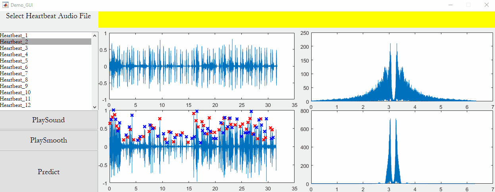

# CinC-2016-Abnormal-Heartbeat
My take on CinC challenge 2016 competition where the goal was to classify between normal and abnormal noisy heartbeat signal. This was a semester project during my master's degree.

**Demo**

Standalone matlab Demo is provided in the demo folder with a GUI (see below).

**Report**

Also included is a technical report providing details on this project. Please note that this is an older project and the report may contain some outdated references.

**Code**

Code is provided as is. Code clean up is required as there may be some issues of path etc.